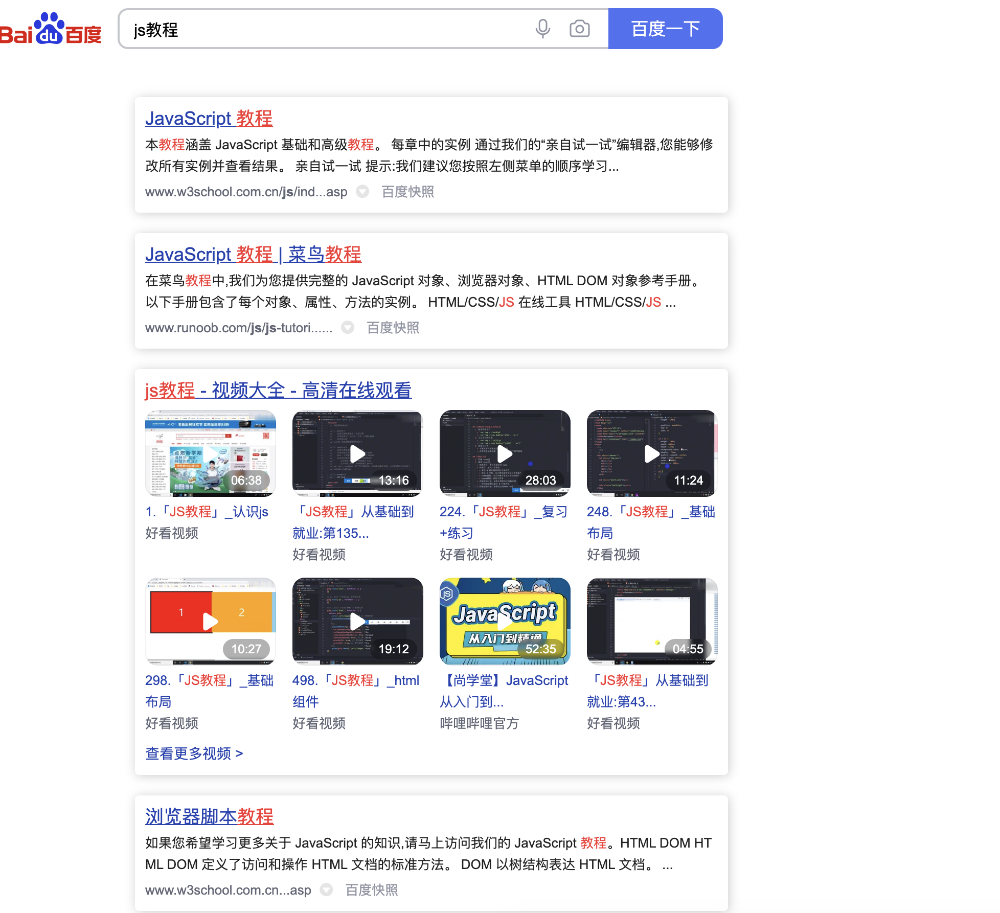
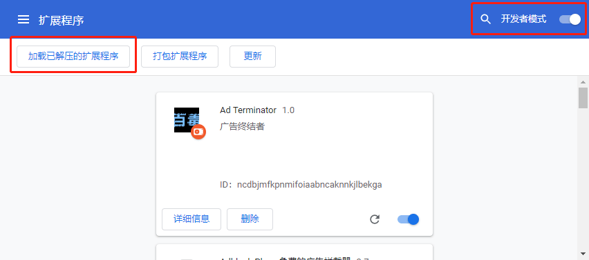
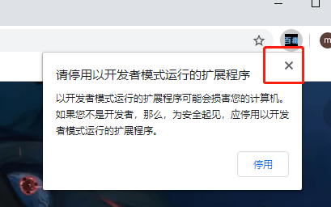
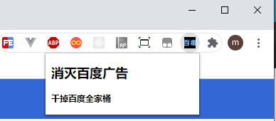

# Anti-Hundred-Poison
这是一款可以让你的百度清净的谷歌插件,可以有效的屏蔽百度全家桶相关的搜索结果,以及一些杂乱无章的东西

#### 安装插件会屏蔽包括但不限于: 
1. 百度首页无关于搜索的按钮, 广告之类
2. 百度全家桶(类似百度知道, 百度文库, 百度百科)
3. 百度搜索界面一些设置按钮
4. 另外着重屏蔽了CSDN，如有冒犯，请勿使用

>仅推荐专业人士使用, 不承担任何后果

#### 先看看最终效果,清爽了许多

#### 安装方法
  1. 下载(克隆), 把文件夹保存起来(这个就是解压后的谷歌插件) 
  2. 打开谷歌浏览器,进入插件设置界面`chrome://extensions/`
  3. 打开开发者模式-加载已解压的扩展程序
  4. 
  5. 愉快的搜索吧

#### 如何更新
1. 如果原先是克隆的，那么执行`git pull`即可
2. 其他：再下载一次也行，执行一遍**安装方法**即可
#### 屏蔽原理
1. 如果搜索条件有关于百度全家桶的字眼, 那么这一行会被抹去;
2. 如果是右侧广告,则会隐藏
3. 宁可错杀一千,绝不放过一个

#### 欢迎诸位同仁志士提供意见

#### Q&A
Q: 会对百度搜索结果产生影响吗?

A: 不会, 没那个能耐, 仅仅是用js和css进行页面层面上的删除和隐藏

Q: 加载未知谷歌插件会被挖矿吗?

A: 我也想 0.0

Q: 安装未知插件, 谷歌提示了咋办?

A: 当然是选择点叉叉忽略呗, 还能咋样, 原谅!

#### 不定期更新&维护
#### 2022-07-14 更新
1. 隐藏相关搜索（主体内容都搜不到，还指望相关搜索）
2. 大幅度提交脚本性能，再也不会像之前那么卡顿，欢迎升级
3. 谷歌插件升级到了版本`3`，如果你不知道这是啥，那么也不需要注意
#### 2021-09-09 更新

1. 增加度小满钱包等更多关键字
#### 2021-07-30 更新

1. 增加度小满等更多关键字

#### 2021-04-03 更新

1. 屏蔽百度投放广告
#### 2020-11-02 更新

1. 修复卡顿问题

#### 2020-07-22 更新

1. 增加 百度百聘, 百度号码认证平台, 百度商桥, 有钱花 等十余种关键字, 屏蔽的内容更加丰富
2. 内容风格优化

#### 2020-07-16 更新

>chrome 83版本不会提示插件不在市场里了, 还可以固定插件了

